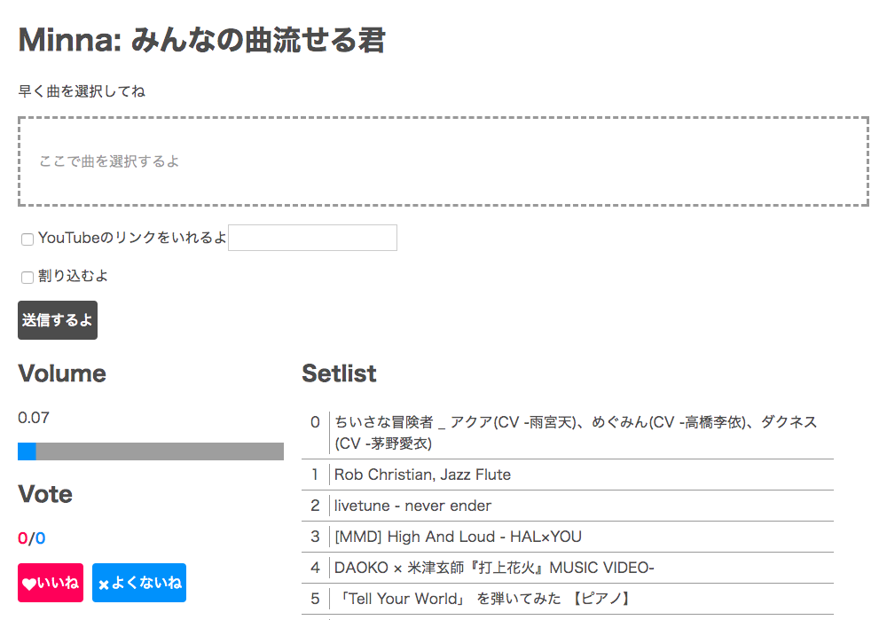

# Minna

みんなの曲流せる君



## Functions

- 楽曲を送信して再生
- 割り込み機能
- [youtube-dl](https://rg3.github.io/youtube-dl/)によってYouTubeなどをサポート

### Volume

- ブラウザから音量調整

### Vote

- 「よくないね」が5になると曲がスキップ
- 「いいね」が50になるとセットリストの最後に現在の曲が追加

### Setlist

- 現在追加されている曲を表示

## Setup

```zsh
brew install youtube-dl

# ./client
yarn

# ./server
yarn
```

### Run

```zsh
# ./server
yarn start
open http://localhost:8000


# ./client
yarn start
```